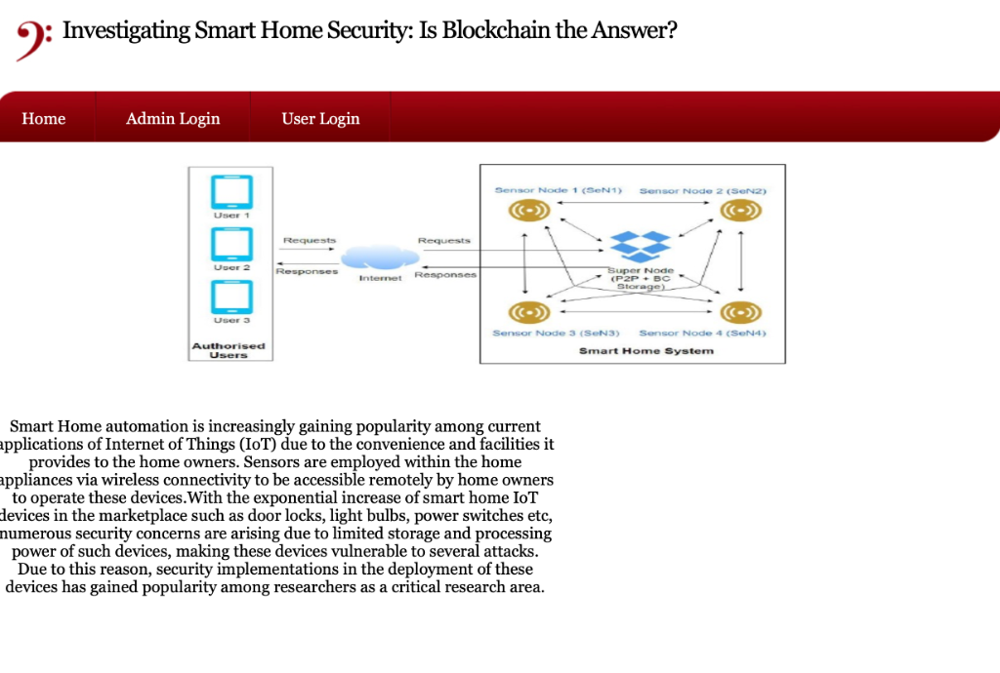
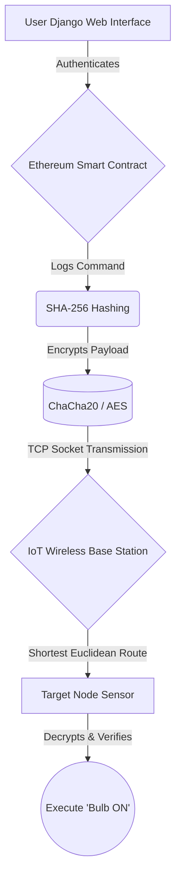
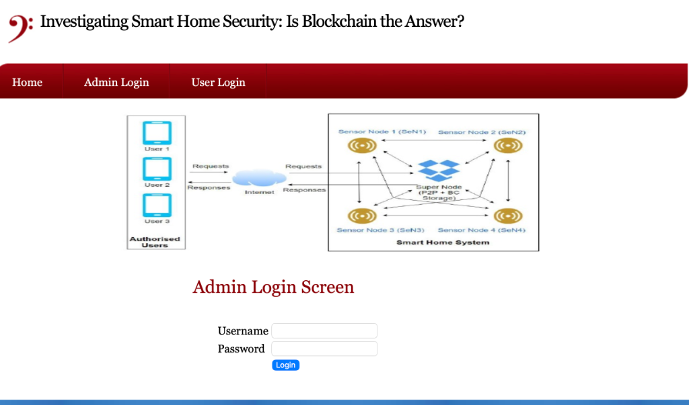
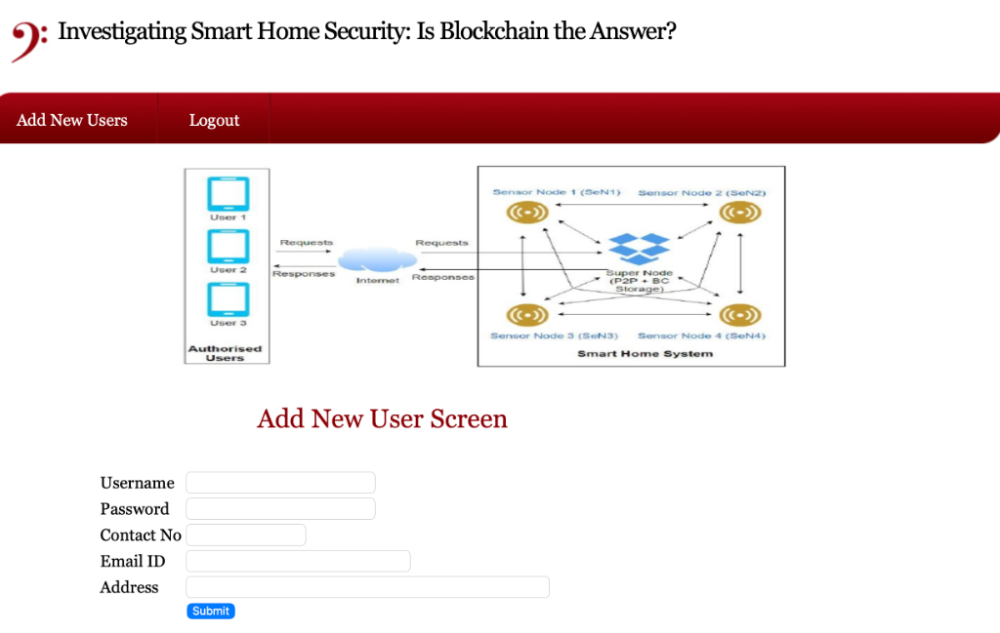
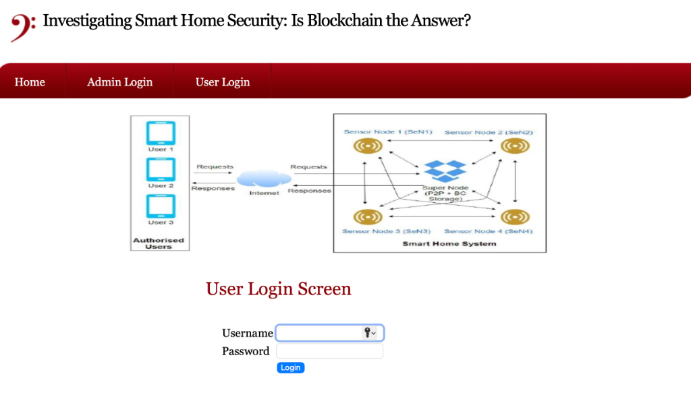
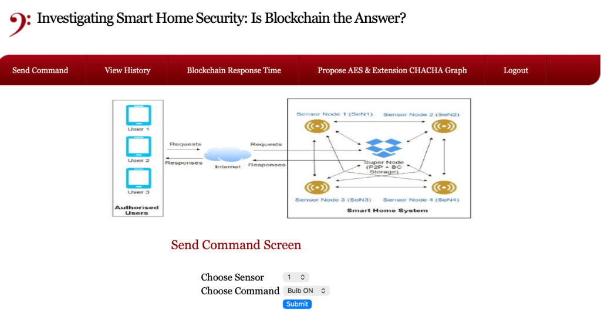
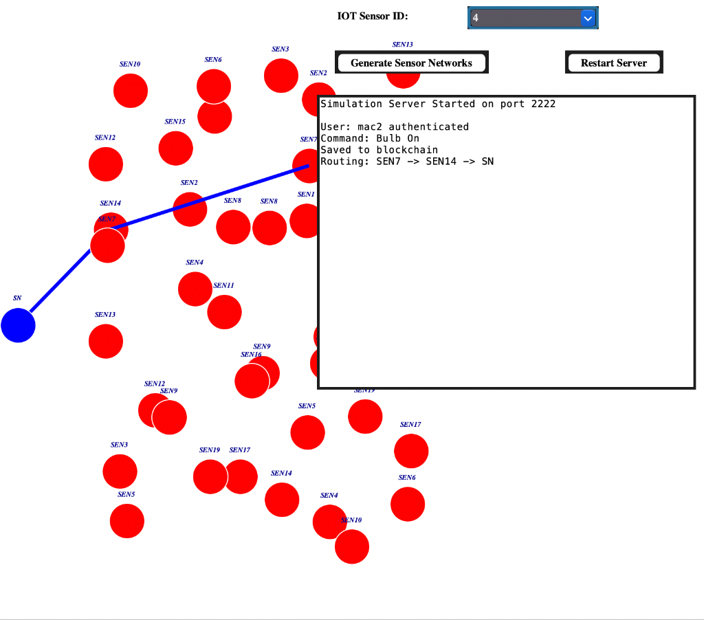
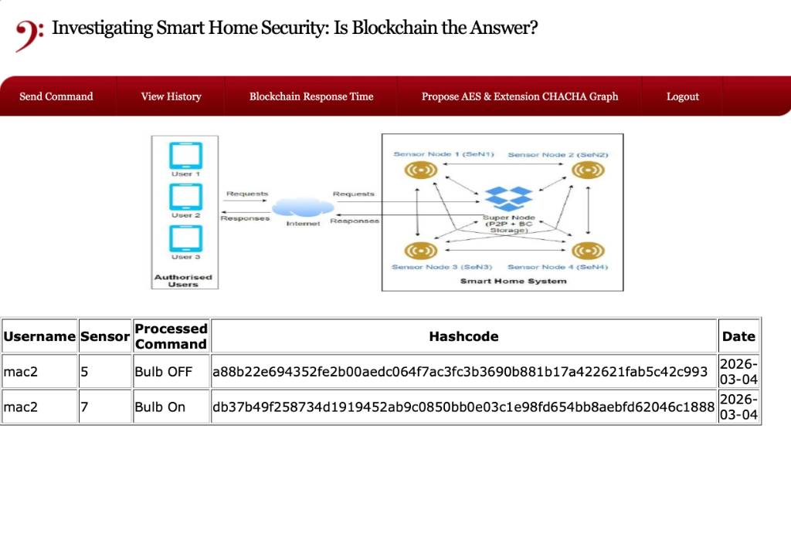
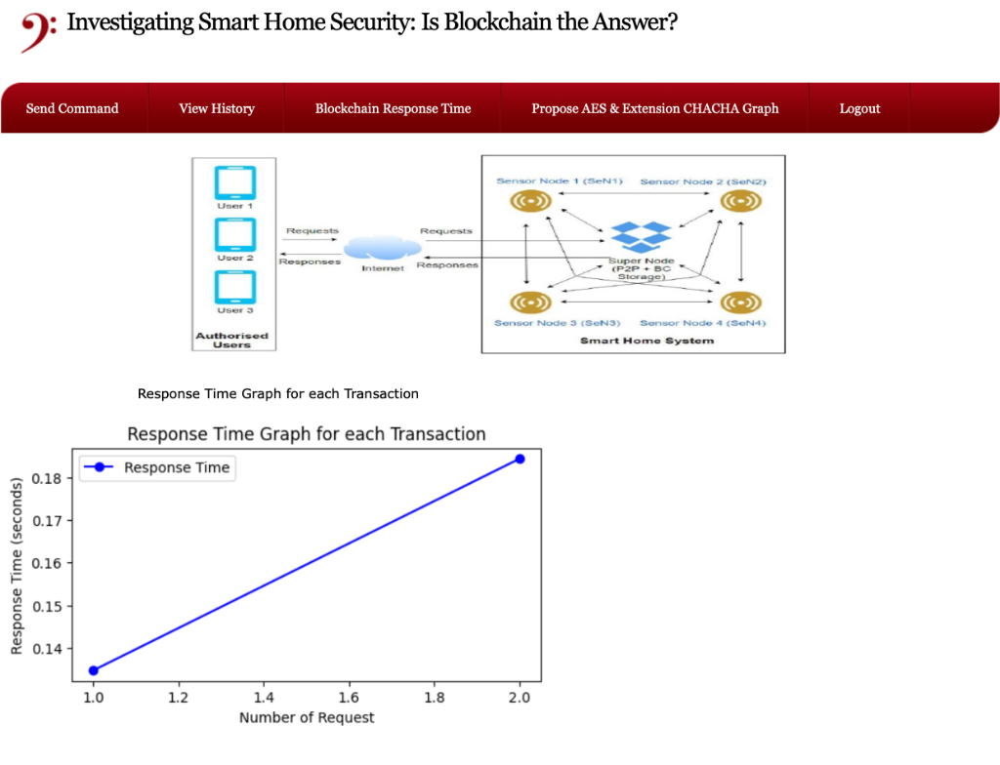
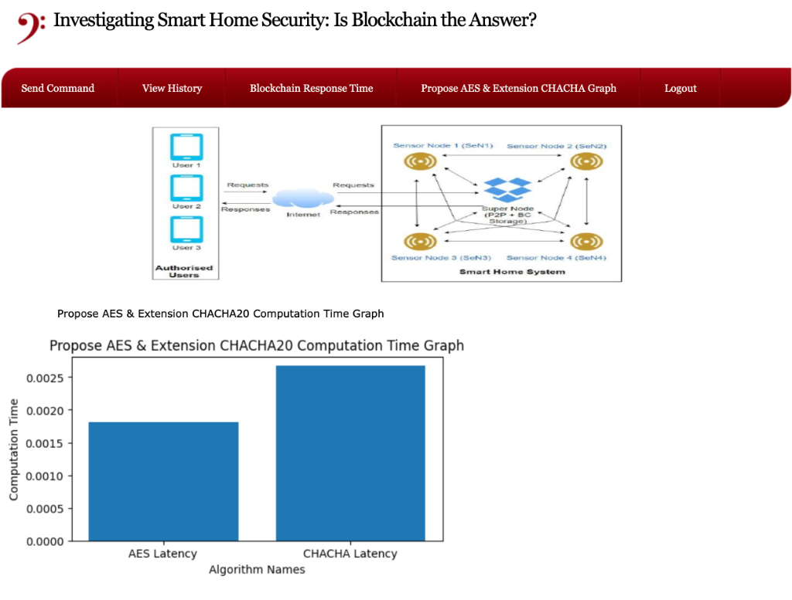

<div align="center">
  
  
  
  

  <br><br>

  <h1>🏠 Investigating Smart Home Security: Is Blockchain the Answer?</h1>
  <p><b>Securing low-power IoT communications using Ethereum Smart Contracts and Lightweight Stream Cryptography</b></p>
  
  <br>
  
  
</div>

---

## 🚀 Welcome to the Future of Smart Home Security

Modern Smart Homes are convenient, but they suffer from severe security flaws. **Centralized cloud servers** create single points of failure, while **low-power IoT sensors** (like smart bulbs and thermostats) struggle to process heavy encryption protocols. 

This project proves that we can solve both problems by **hybridizing Decentralized Storage (Ethereum) with High-Speed Stream Cryptography (ChaCha20).**

<br>

---

## 🎯 The Core Problem

> *Why are our homes so vulnerable?*

1. **Centralized Attack Vectors:** Traditional IoT networks rely on centralized databases. If the central hub is hacked, the entire home is compromised.
2. **Resource Constraints:** Tiny IoT microcontrollers simply do not have the battery, memory, or CPU power to handle standard asymmetric encryption (like RSA).
3. **Data Tampering & Replays:** Without proper payload verification, hackers can intercept a "Door Unlock" command and replay it later to gain physical entry to a home.
4. **Zero Transparency:** Homeowners have no verifiable, unalterable log of exactly *who* modified a device state and *when*.

<br>

---

## 🛡️ The Hybrid Architecture Solution

This system completely redesigns how smart home commands are authenticated and transmitted over the air.

### 1. Decentralized Ledger (Ethereum)
We completely eliminate the centralized database. 
* Every user registration transaction is permanently written to the Ethereum blockchain.
* Before any IoT device acts on a command, the system queries the `SmartHome.sol` Smart Contract to guarantee the user has cryptographic permission to send that command.

### 2. Payload Encryption (AES vs. ChaCha20)
To prevent interception, commands are fully encrypted end-to-end.
* **The Comparison:** The project natively supports standard **AES Block Ciphers**, but specifically introduces the **ChaCha20 Stream Cipher** as an optimized extension.
* **Why ChaCha20?** It is designed specifically for software-only execution on low-power chips that lack hardware encryption acceleration, encrypting significantly faster while using a fraction of the battery life.

### 3. Absolute Data Integrity (SHA-256)
Before transmission, the raw command (e.g., `user#sensor1#Bulb_ON#Date`) is hashed using SHA-256. The IoT Sensor verifies this hash upon receipt, guaranteeing the payload wasn't tampered with mid-flight.

<br>

---

## ⚙️ How It Works Behind the Scenes



1. **Command Initiation:** The user logs into the Django web app and fires a command.
2. **Blockchain Verification:** `web3.py` talks to the local Ganache/Truffle chain to verify identity and record the intent immutably.
3. **Wireless Routing Calculation:** The Python Tkinter IoT Simulation calculates the actual physical distance between simulated sensor nodes, determining the optimal, multi-hop "Euclidean" route from the Base Station to the target device.
4. **Execution:** The target sensor decrypts the package and visualizes the change.

<br>

### 🖼️ Application Walkthrough

#### Admin & User Management
<p align="center">
  
  
  
</p>

#### Command Control & Simulation
<p align="center">
  
  
</p>

#### Blockchain Logs & History
<p align="center">
  
</p>

<br>

---

## 📊 Live Performance Benchmarks

The project isn't just theoretical; it proves its viability through live, dynamically generated graphical benchmarks:

* ⏱️ **Blockchain Response Time:** Real-time matplotlib graphs demonstrating the strict transaction latency required to mine a Smart Contract command. Proof that blockchain can handle near-real-time IoT requirements.

<p align="center">
  
</p>

* ⚡ **Encryption Optimization:** A generated bar chart proving that the extended ChaCha20 implementation computes encryptions faster than standard AES, vastly reducing computational overhead.

<p align="center">
  
</p>

<br>

---

## 🛠️ Technology Stack

| Ecosystem | Technologies Used |
| :--- | :--- |
| **Frontend/Backend** | Python 3.10, Django Framework, HTML5/CSS3 |
| **Blockchain** | Ethereum EVM, Solidity, Truffle Suite, Ganache |
| **Integrations** | `web3.py`, `socket` (TCP Networking) |
| **Cryptography** | `pyCryptodome` (ChaCha20), `pyaes`, `hashlib` |
| **IoT Visualizer** | Python `Tkinter` (GUI Canvas), Euclidean Math |
| **Data Science** | `matplotlib`, `numpy`, `BytesIO` |

<br>

---

## 💻 Running the Project Locally

Want to see the simulation in action? Follow these steps:

### 1️⃣ Start the Decentralized Network
Navigate to the `hello-eth` directory to wake up your local Ethereum Testnet:
```bash
npx truffle develop
```
*Once the `truffle(develop)>` console opens, deploy the contract:*
```bash
migrate
```

### 2️⃣ Start the Web Application
Open a **new** terminal, navigate to the `SmartHome` directory, and boot the Django backend:
```bash
python manage.py runserver
```
*Access the beautiful UI at `http://127.0.0.1:8000`*

### 3️⃣ Wake Up the IoT Devices
Open a **third** terminal, navigate to the `SmartHome` directory, and launch the graphical node simulator (which handles the TCP socket server):
```bash
python IOTSimulation.py
```
*(Optionally click "Generate Sensor Networks" to visually map out your IoT environment).*

---
<div align="center">
  <i>"Blockchain isn't just for finance; it's the missing security layer for the physical devices inside our homes."</i>
</div>
